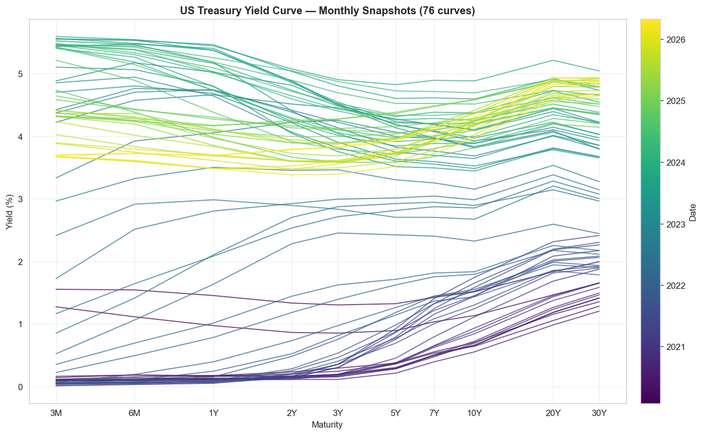
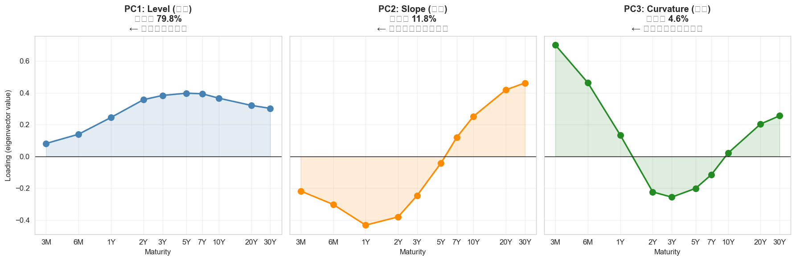
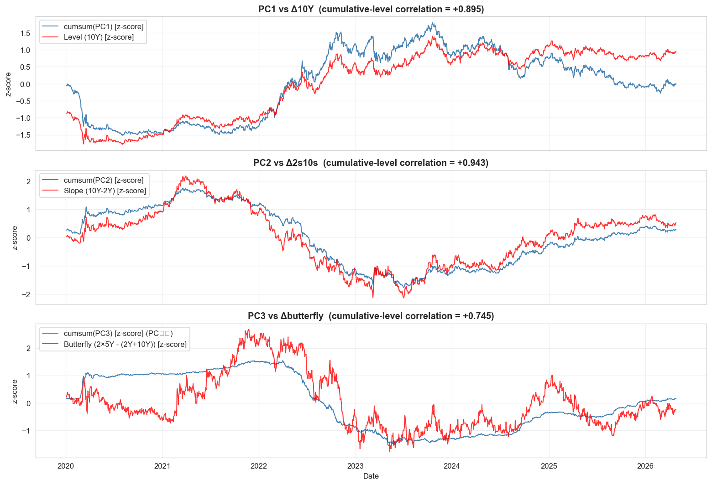

# Yield Curve PCA

**A from-scratch PCA decomposition of the US Treasury yield curve into Level / Slope / Curvature, plus a candid backtest of a PC2 mean-reversion strategy.**

[](https://github.com/Hiroto-734/yield-curve-pca/actions/workflows/test.yml)
[](https://www.python.org/)
[](LICENSE)

This project reproduces Litterman & Scheinkman (1991) on the 2020-2026 sample, then pushes further by building and honestly evaluating a systematic strategy on top of the extracted PC2 (Slope) factor.

---

## Table of Contents

1. [The Question](#the-question)
2. [The Approach](#the-approach)
3. [Key findings](#key-findings)
4. [Demo figures](#demo-figures)
5. [Honest limitations](#honest-limitations)
6. [Quick start](#quick-start)
7. [Project structure](#project-structure)
8. [Notebooks](#notebooks)
9. [Glossary](#glossary)
10. [What I learned](#what-i-learned)
11. [日本語版](#日本語版)

---

## The Question

Fixed income desks have talked about the yield curve in terms of three things — *Level*, *Slope*, *Curvature* — for as long as there has been a yield curve to talk about. The 1991 Litterman & Scheinkman paper showed those aren't just convenient labels: they fall out of PCA almost mechanically. The original spec for this project asked me to reproduce that finding on US Treasury data.

Two questions then become unavoidable:

1. **If the curve really decomposes into a few clean factors, can you trade them?** The decomposition is the easy part — what does it actually buy you in execution?
2. **Where does the decomposition fail?** PC1 ≈ 10Y is so tight that "trading PC1" is just trading 10Y. The interesting answer lives in what's *not* covered by the easy approximations.

This project answers both, on US Treasury data from 2020 to April 2026.

---

## The Approach

Two phases.

**Phase 1 — Decomposition (Notebooks 01-05).** Pull daily yields for ten US Treasury maturities (3M to 30Y) from FRED for 2020-01-02 → 2026-04-27 (1,580 business days). Clean and convert to bp changes, decompose via PCA, then interpret the resulting components against the traditional human-friendly factors (10Y level, 2s10s spread, butterfly). Verify the **96.2%** explained-variance result and the textbook factor shapes; quantify exactly where the human indicators do and don't recover the PC structure.

**Phase 2 — Strategy and diagnostics (Notebooks 06-09).** Build a PC2-based mean-reversion strategy as the first development task. Run a baseline backtest, attribute the losses, layer in five candidate improvements, quantify the theoretical ceiling via perfect-foresight projection, and finally regress the PC scores against macro releases (CPI / NFP / FOMC) to see how much of the dynamics is explainable from public macro data.

The whole project is structured to be reproducible from scratch: every parquet artifact in `data/processed/` and every figure in `reports/figures/` is regenerated by running the notebooks in order against the installable `yield_curve_pca` package.

---

## Key findings

* **PCA recovers the textbook factor structure on 2020-2026 data.** Top three components explain 96.2% of variance (PC1 = 79.8%, PC2 = 11.8%, PC3 = 4.6%). The factor *shapes* match Litterman-Scheinkman exactly: PC1 loadings are uniformly positive (Level), PC2 flips sign across the belly (Slope), PC3 has positive wings vs. negative belly (Curvature).
* **PC1 ≈ 10Y and PC2 ≈ 2s10s, but PC3 ≠ butterfly.** Daily-change correlation of PC1 vs Δ10Y is 0.96, PC2 vs Δ2s10s is 0.91 — the spec targets are met. PC3 vs the spec's narrow 2-5-10 butterfly is only 0.26, and the best alternative wide butterfly tops out at 0.59. Curvature is where PCA's optimality actually buys you something a 3-point indicator cannot replicate.
* **A naive mean-reversion strategy on PC2 loses money** (Sharpe -0.38 over 2020-2026), and the loss is statistically distinguishable from random-strategy baselines. The strategy bleeds during regime shifts; loss attribution shows |z-score| has correlation -0.55 with daily P&L, meaning **bigger signals correlate with worse trades** — the opposite of the textbook expectation.
* **Adding a regime classifier flips the sign of the Sharpe.** A simple "ranging vs trending" filter (|60-day cumulative PC2| ≤ 30bp = ranging) restricts trading to 17% of days but takes Sharpe to +0.06. This is still noise-level, but it isolates the one filter that matters: **when** to trade is a bigger lever than **how**.
* **The theoretical Sharpe ceiling is ~16** (perfect-foresight projection onto PC2). Industry-grade systematic strategies typically realize 0.5-1.5; the mapping from hit rate to Sharpe shows that just 52-54% directional accuracy on a daily PC2 signal would already produce 0.5-1.0.
* **PC1 reacts to macro releases by ~1.5x.** PC1 std on FOMC / CPI / NFP release days is **22.9 bp vs 14.9 bp** on non-release days. In joint regression, the FOMC dummy is the only feature that survives (β = **−7.24 bp on PC1, p < 0.001**) — confirming PC1 as the macro-policy factor. CPI/NFP proxy surprises don't reach significance because the free-data substitute (deviation from rolling mean) doesn't capture true consensus surprise; comparable studies with Bloomberg consensus typically reach R² of 5-20%.
* **PCA-based immunization eliminates 96% of P&L variance.** A $100M long-30Y portfolio has daily P&L std of $1.66M unhedged. Hedging PC1 with a 10Y instrument cuts that 85%; adding a 2Y to hedge PC2 gets to 90%; adding 3M and 20Y to hedge PC3 reaches **96.03%** variance reduction — exactly the 96.2% explained-variance budget the PCA started with. The same PCA model that couldn't be **predicted off** in Notebooks 06-08 can be **hedged off** cleanly, which is the asymmetry the project is built around.

---

## Demo figures

### Yield curve shape over six years



Each line is a month-end snapshot, colored by date. The arc from low/flat (2020 COVID) → high/inverted (2023) → re-steepened (2026) makes the **Level** and **Slope** dynamics visible without any analysis.

### PCA factor loadings



These three shapes — emitted by a procedure that knows nothing about finance — match the qualitative factors fixed-income desks have used for decades.

### PC scores reproduce traditional indicators (Level, Slope) but not Curvature



Cumulative PC1 tracks the 10Y level almost perfectly. Cumulative PC2 tracks 2s10s. PC3 tracks butterfly only loosely — see Notebook 04 for the full discussion.

---

## Honest limitations

Things to be aware of when reading the results:

* **Single window, no walk-forward.** Backtests use the full 2020-2026 sample. There is no rolling out-of-sample / walk-forward validation. The 6×6 sensitivity grid (Notebook 06) and the random-strategy baseline (also Notebook 06) provide partial robustness checks, but not full out-of-sample verification.
* **No transaction costs in the backtest.** Adding 0.25-0.5 bp per trade leg would shift the regime-strategy Sharpe from +0.06 to negative. The +0.06 should be read as "the strategy is not a money pit before frictions," not "the strategy makes money in production."
* **Proxy macro surprises only.** Notebook 09 uses `(actual MoM) − (6-month rolling average MoM)` as a stand-in for true consensus surprise. The `R² < 1%` regression result is a data-quality limitation; with Bloomberg/Refinitiv consensus data, comparable studies typically reach R² of 5-20%.
* **Single market.** US Treasuries only. The factor structure is known to look qualitatively similar across major sovereigns (Bunds, JGBs, Gilts), but cross-country comparison is not in scope for this iteration.
* **The 2020-2026 window is unusual.** It contains the COVID emergency easing, the fastest US hiking cycle in 40+ years, and the longest yield-curve inversion on record. The factor decomposition (and any strategy fit to it) may not generalize to calmer regimes — PC1 explained variance, for instance, lands at 79.8% here vs the 85-90% typical of pre-COVID samples.
* **Sharpe +0.06 is not investable.** The regime-classifier strategy turns positive but stays well inside noise. Treat it as a quantification of "where mean reversion can and can't work," not as a deployable signal.

Each of these is a deliberate scope choice, not an oversight. They map onto natural next steps listed in [`reports/findings.md`](reports/findings.md#6-limitations-and-what-id-do-next).

---

## Quick start

Requires Python 3.11+. Tested on Python 3.12.10 (Windows / Git Bash).

```bash
# Clone and enter the project
git clone <YOUR_FORK_URL> yield-curve-pca
cd yield-curve-pca

# Create a virtual environment with uv (or use python -m venv)
python -m pip install uv          # if uv isn't installed
python -m uv venv

# Activate the venv
source .venv/Scripts/activate     # Windows (Git Bash)
# source .venv/bin/activate       # macOS / Linux

# Install the package and dev dependencies in editable mode
uv pip install -e ".[dev]"

# Run the test suite
pytest

# Run the notebooks (or just open them in JupyterLab)
PYTHONUTF8=1 jupyter lab
```

### Reproducing the analysis end-to-end

The notebooks under `notebooks/` are numbered and meant to run in order. Each one loads its inputs from the parquet files left behind by the previous notebook, so re-running notebook 03 is enough if you only want to re-fit the PCA. To regenerate everything from scratch, delete `data/processed/` and `reports/figures/` first, then run notebooks 01 → 09 in sequence (or run `make notebooks` if a Makefile is present).

---

## Project structure

```
yield-curve-pca/
├── src/yield_curve_pca/         # Installable package (`pip install -e .`)
│   ├── data/
│   │   ├── loader.py            # FRED CSV fetching
│   │   └── preprocessor.py      # Clean & convert to bp changes
│   ├── analysis/
│   │   ├── pca_analyzer.py      # YieldCurvePCA class
│   │   └── backtest.py          # Strategy backtest engine
│   ├── visualization/           # Reserved for Phase 2 expansion
│   └── utils/
│       └── config.py            # Constants (maturities, FRED endpoint, …)
│
├── notebooks/                   # Phase 1 (01-05) + development tasks (06-09)
├── tests/                       # 27 unit tests (pytest)
│
├── data/
│   ├── raw/                     # Raw FRED CSV (gitignored, regenerable)
│   └── processed/               # Cleaned parquet artifacts
│
├── reports/
│   ├── figures/                 # Publication-quality PNGs
│   └── findings.md              # Interview-ready deliverable
│
├── pyproject.toml
├── README.md
└── yield_curve_pca_spec.md      # Original project specification
```

---

## Notebooks

| #  | File                                          | Purpose                                                                 |
|----|-----------------------------------------------|-------------------------------------------------------------------------|
| 01 | `01_data_exploration.ipynb`                   | Fetch yields from FRED, clean, plot, save                               |
| 02 | `02_curve_dynamics.ipynb`                     | Daily bp changes, slope indicators, Bull/Bear × Steep/Flat regimes      |
| 03 | `03_pca_basics.ipynb`                         | Apply PCA, explained variance, loadings interpretation                  |
| 04 | `04_pca_interpretation.ipynb`                 | Compare PCs against 10Y / 2s10s / butterfly                              |
| 05 | `05_event_study.ipynb`                        | FOMC days vs ordinary days; three case studies; generates `findings.md` |
| 06 | `06_pc2_mean_reversion.ipynb`                 | First systematic strategy attempt (negative result, with diagnosis)     |
| 07 | `07_loss_analysis_and_improvements.ipynb`    | Loss attribution + five improvement variants                            |
| 08 | `08_strategy_ceiling_and_walkthrough.ipynb`   | Theoretical Sharpe ceiling + entry/exit walkthrough                     |
| 09 | `09_macro_factor_regression.ipynb`            | Regress PC scores on CPI/NFP/FOMC                                        |
| 10 | `10_pca_immunization.ipynb`                   | DV01, portfolio, PC factor exposures, P&L decomposition (Phase 1)        |
| 11 | `11_immunization_backtest.ipynb`              | Hedge construction + 4-variant backtest, 96% variance reduction (Phase 2) |

---

## Glossary

For a project-specific reference of the financial and statistical terms used here (yield, CMT, bp, butterfly, DV01, look-ahead bias, walk-forward, regime classifier, …), see [`docs/glossary.md`](docs/glossary.md).

---

## What I learned

### Technical
* **PCA in practice**: standardization is not free — it changes how loadings are interpreted. For same-unit inputs, skipping it preserves direct bp interpretability of the factors.
* **Reproducibility discipline**: every parquet is the output of an upstream notebook; no silent edits. This took deliberate engineering once notebooks started multiplying.
* **Backtest correctness**: implementing `position[t] = f(z_score[t-1])` correctly via `.shift(1)` is non-negotiable. Verifying it with a deliberate "smash the future" perturbation test gave me real confidence the modular implementation has no look-ahead.
* **Statistical hygiene**: comparing a strategy's Sharpe to a random-strategy distribution is what made "+0.06" legible as "still noise" rather than "small but real." Without that benchmark you'd be tempted to keep tuning a fundamentally negative strategy.
* **Module extraction**: the rewrite from notebooks → `src/yield_curve_pca/` reproduced the original results bit-for-bit, which is the only meaningful test that the refactor didn't break anything.

### Financial
* **Yield, not coupon**: the number on a screen is the implied yield from today's price, not the bond's coupon — they only coincide at issuance. Price ↑ → yield ↓ is the same arbitrage statement as duration sensitivity.
* **Inversion ≠ recession in 2022-2024**: the longest US inversion in 40+ years was driven by the Fed pre-emptively hiking against inflation, not by the market pricing recession. The textbook signal-from-history broke because the cause was unusual.
* **It's the surprise, not the action**: the 75bp hike on 2022-06-15 produced a Bull-Steepener, not the textbook Bear-Flattener, because the WSJ leak two days earlier had moved the priced-in expectation. The market reacts to (actual − expected), not to actual.
* **PCA reveals what curves move on, but it doesn't trade itself**: PC1 ≈ 10Y is so tight that a PCA-based "Level alpha" is just a 10Y trade. The interesting use cases are PC2 (Slope) regime detection and PC3 (Curvature) for trades a 3-point butterfly literally cannot represent.

---

## 日本語版

### 問い

イールドカーブは何で動いているのか — それを 3 つの因子(Level / Slope / Curvature)で説明できる、というのが Litterman & Scheinkman (1991) の古典的発見。本プロジェクトはまずこれを 2020-2026 年の米国債データで再現し、その上で **2 つの問い** に答えた:

1. **3 因子に分解できるなら、それを使ってトレードできるか?**(分解は易しい、で実装は?)
2. **どこで分解は破綻するか?**(PC1 ≈ 10Y は強すぎる近似、本当に面白いのは「人間指標で捕捉できない部分」)

### アプローチ

2 フェーズ構成:

* **Phase 1(Notebooks 01-05)**:FRED から 10 年限の日次利回りを取得 → クリーニング → bp 変化に変換 → PCA → 人間指標(10Y、2s10s、バタフライ)との対応関係を定量化。
* **Phase 2(Notebooks 06-09)**:PC2 を使った平均回帰戦略を構築 → 失敗 → 損失帰属で原因特定 → 5 つの改良案 → 理論上限の計算 → マクロ要因との回帰。

`src/yield_curve_pca/` に installable package、27 件の pytest、CI/CD まで揃えた reproducible な構成。

### 主な発見

### 主な発見

* **PCA が金融用語を再発見**: PC1 ≈ Level、PC2 ≈ Slope、PC3 ≈ Curvature。Litterman-Scheinkman そのまま。
* **PC1 と 10Y は相関 0.96、PC2 と 2s10s は相関 0.91、PC3 と3点バタフライは 0.26**(narrow)〜 0.59(best wide) → **Curvature は PCA の最適性が必要な唯一の領域**。
* **素朴な平均回帰戦略は Sharpe -0.38 で負け**。失敗の原因を損失帰属分析で定量化(|z-score| が P&L と相関 -0.55、つまり **強い信号ほど負ける**)。
* **Regime classifier だけが Sharpe をプラス(+0.06)に**。「いつトレードするか」が「どうトレードするか」より重要。
* **Sharpe の理論上限は約 16**(perfect foresight)。Production レベルは 0.5-1.0、これに必要な hit rate は約 52-54%。
* **PC1 はマクロ発表に 1.5 倍反応**: PC1 std がリリース日 22.9 vs 通常日 14.9 bp。Joint regression で **FOMC ダミーのみ有意**(β = -7.24 bp、p<0.001)。CPI/NFP の代理サプライズは無料データの限界で R² < 1%(本物のコンセンサス予想なら 5-20% の見込み)。
* **PCA イミュナイゼーションで P&L 分散を 96% 削減**: $100M 30Y ロングのポートフォリオに対して、PC1+PC2+PC3 を {3M, 5Y, 20Y} でヘッジ → 日次 std $1.66M → $0.33M(96.03% 削減)。PCA で予測しようとして負けた(Sharpe -0.38)同じ3因子が、ヘッジに使うと劇的に効くという**非対称性**が本プロジェクトの中核メッセージ。

### ハイライトのストーリー(面接5分)

> 米国債10年限の日次変動に PCA を適用し、上位3軸が 96.2% の分散を説明することを確認した。それぞれが Level / Slope / Curvature に対応し、Litterman & Scheinkman (1991) の古典的結果を再現した。
>
> 一方で、PC3 と spec の3点バタフライは相関 0.26 にとどまった — これは PCA が3点指標を超えた高次の curvature 構造を捉えていることを意味する。Level / Slope は人間指標で十分近似できるが、**Curvature は PCA の最適性が活きる唯一の領域**。
>
> さらに PC2 を使った平均回帰戦略をバックテストしたところ、素朴な版は Sharpe -0.38 で負けた。損失帰属分析で「強い信号ほど負ける」(|z-score|と P&L の相関 -0.55)という反直感的な発見を定量化し、regime classifier を追加することで Sharpe を +0.06 まで改善した(production レベルにはまだ遠いが、改良の方向性は明確)。
>
> このプロジェクトは「**仮説 → 実装 → honest な検証 → 失敗からの改良**」というクオンツ研究のフルサイクルを示すものとして組み立てた。

### 限界(誠実に)

* **Walk-forward 未実施** — 全期間バックテスト。感度グリッドとランダム比較で部分的な robustness は確認済みだが、ローリング out-of-sample 検証はしていない。
* **取引コストなし** — Sharpe +0.06 は「コスト前で赤字ではない」レベル。コスト含めると簡単に負ける。
* **マクロサプライズは代理変数** — 真のコンセンサス予想(Bloomberg)が無料で取れないため、6ヶ月平均からの乖離で代用。R² < 1% はデータの限界。
* **米国債のみ** — Bunds、JGBs への展開は scope 外(発展課題で残置)。
* **2020-2026 は異常な期間** — COVID、過去最速の利上げ、過去最長の逆イールドを含む。他の局面に外挿できる保証はない。
* **Sharpe +0.06 は実運用不可** — production には Sharpe 0.5+ が必要、HMM・クロスアセット features 等の追加が必要。

詳細は [`reports/findings.md`](reports/findings.md#6-limitations-and-what-id-do-next) の「Limitations and what I'd do next」を参照。

### ディレクトリ構造

詳細は上の英語セクションを参照。要点だけ:

* `src/yield_curve_pca/` — installable パッケージ。loader / preprocessor / pca_analyzer / backtest
* `notebooks/01-09` — Phase 1(基礎)+ 発展課題(戦略バックテスト + マクロ回帰)
* `tests/` — pytest ユニットテスト 27 件
* `reports/findings.md` — 面接で5分話せるサマリー

---

## License

MIT — see [LICENSE](LICENSE).

## Acknowledgements

* Federal Reserve Economic Data ([FRED](https://fred.stlouisfed.org/)) for the raw yield series.
* Litterman, R. and Scheinkman, J. (1991). *"Common Factors Affecting Bond Returns."* The Journal of Fixed Income, 1(1), 54-61.
* Developed with assistance from Anthropic's [Claude Code](https://www.anthropic.com/claude-code) — used for code-review dialogue, refactoring suggestions, documentation polish, and as a sounding board while debugging negative results. Final design decisions, financial interpretations, and the "honest negative result" framing are mine; Claude was a fluent reviewer, not the author.
